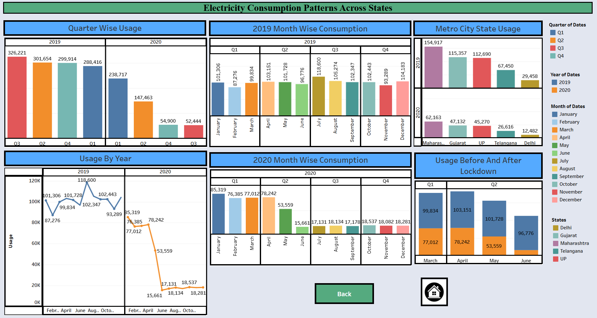

# Plugging-into-the-Future-An-Exploration-of-Electricity-Consumption-Patterns

This Tableau dashboard project explores electricity consumption trends across different sectors and geographies. It aims to reveal critical insights into energy usage behavior and support energy-conscious decision-making.

---

## 📁 Repository Structure

- 1.Assignments/ – Initial tasks and exercises  
- 2.Ideation Phase/ – Brainstorming and idea finalization  
- 3.Requirement Analysis/ – Gathering and documenting system requirements  
- 4.Project Design Phase/ – System and dashboard design artifacts  
- 5.Project Planning Phase/ – Timeline, task allocation, and roadmap  
- 6.Project Executable Files/ – Final Tableau dashboard (.twbx) and datasets  
- 7.Functional & Performance Testing/ – Test cases and results  
- 8.Doc and Demo/ – Final documentation and video walkthrough

---

## 📸 Dashboard Preview

Dashboard 1 

 Dashboard 2 

Dashboard 3 

---

## 📊 Key Insights

- Urban regions show higher consumption than rural areas.  
- Commercial and residential sectors contribute the most to demand.  
- Seasonal usage spikes observed in summer and winter months.  
- States with industrial zones show a steep curve in power needs.

---

## ⚙️ Tools Used

- Tableau Public  
- MS Excel   
- GitHub  
- Google Docs 

As I wrap up my internship, I’m excited to share the final outcome of my learning journey – a comprehensive Tableau dashboard that visualizes electricity consumption patterns in a meaningful way. This project reflects my growth in data analysis, storytelling, and dashboard design.
                                                                        THANK YOU!

                               
---

Contributed by: Sowmya Sri Ganapavarapu  
Date: June 2025

